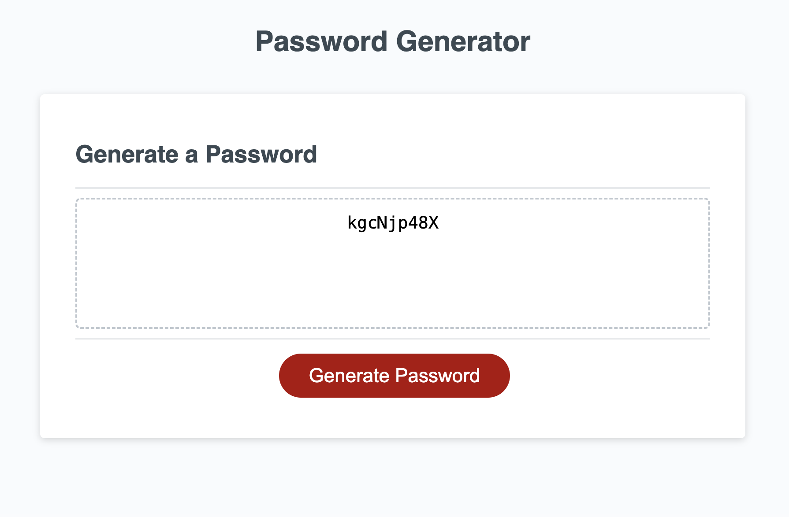
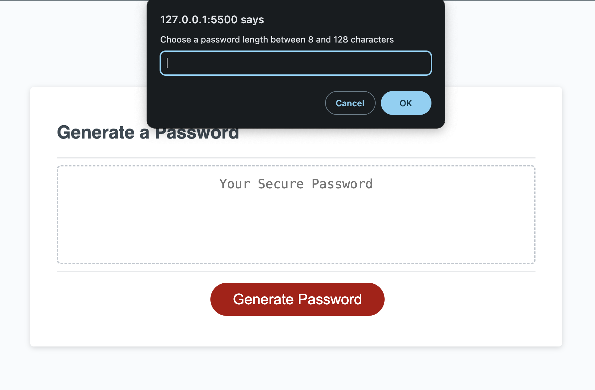

# PasswordGenerator-C-5

## Description 
I have been tasked with creating an app that generates a random password based on the following criteria.

* Generate a password when the button is clicked
  * Present a series of prompts for password criteria
    * Length of password
      * At least 8 characters but no more than 128.
    * Character types
      * Lowercase
      * Uppercase
      * Numeric
      * Special characters ($@%&*, etc)
  * Code should validate for each input and at least one character type should be selected
  * Once prompts are answered then the password should be generated and displayed in an alert or written to the page
  

## Completed Console Display Screenshot

## References
[W3 Schools ](assets/05-javascript-challenge-demo.png )

## Deployed Project Link 
(https://hwilson-hub.github.io/PasswordGenerator-C-5/)

## License

This project is licensed under the MIT License
©2023. Haydawn Wilson. All Rights Reserved.
